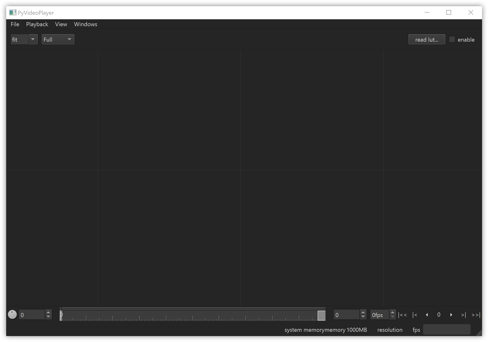

# PyVideoPlayer

This is a simple work in progress image sequence player built with python3 pyside6, opencv and OpenImageIO.

## TODO features
- [x] open files directly with UI
- [x] open video with *drag and drop*
- [ ] open lut with *drag and drop*
- [x] implement Viewer
- [x] add zoom and zoom to fit fit
- [x] zoom around mouse cursor
- [x] zoom around pinch center
- [x] reimplement pan, interferes with zoom around pinch center
- [x] fix is_sequence when video files eg .mp4 ends with a number
- [x] Reader class to support sequence starts at non zero
- [x] loop by default
- [ ] add loop option in gui
- [ ] fix timer. QTimer works with int milliseconds. Eg. 24 fps is 1000/fps=41.66 will set the timer to 41ms frequency.
- [x] export to mp4
- [x] add non blobking export with gui
- [x] dark theme
- [x] fix first frame number when image sequence starts other than 0
- [x] frame scrubbing with a frame dial
- [x] frame scrubbing with right mouse drag on viewer
- [x] mark in, out point
- [x] create a precise frameslider widget with matching cache bar
- [x] LUT
  - [x] read .cube lut files
  - [x] apply lut with cython to pixels
  - [x] create gui buttons to open, en enable lut
  - [x] add LUT to cache key
  - [x] apply lut with trilinear interpolation
  - [ ] read 1D lut
  - [ ] use OpenColorIO for LUT
- [ ] create exe
- [ ] fullscreen
- [ ] use 32bit float internally
- [ ] expusure, gamma

- [ ] give it a better name : )

## compile apply_lut_cython
> python setup.py build_ext --inplace

## TESTS TODO

- [ ] first and last frame equal. Only a singlie frame. Test zoom with timeslider
- [ ] drag and drop files with non-asci characters
- [ ] Test FrameServer
  - [ ] open single file
  - [ ] open an video then open another one

## Build with PyInstaller

> pyinstaller VideoPlayer/main.py

> pyinstaller VideoPlayer/main.py --add-data "C:/Users/andris/AppData/Local/Programs/Python/Python39/Lib/site-packages/PySide6/plugins;PySide6/plugins/"

## How to build with nuitka
> python -m nuitka --mingw64 VideoPlayer/main.py

or standalone:

> python -m nuitka --mingw64 --standalone --plugin-enable=numpy --plugin-enable=pyside6 VideoPlayer/main.py
